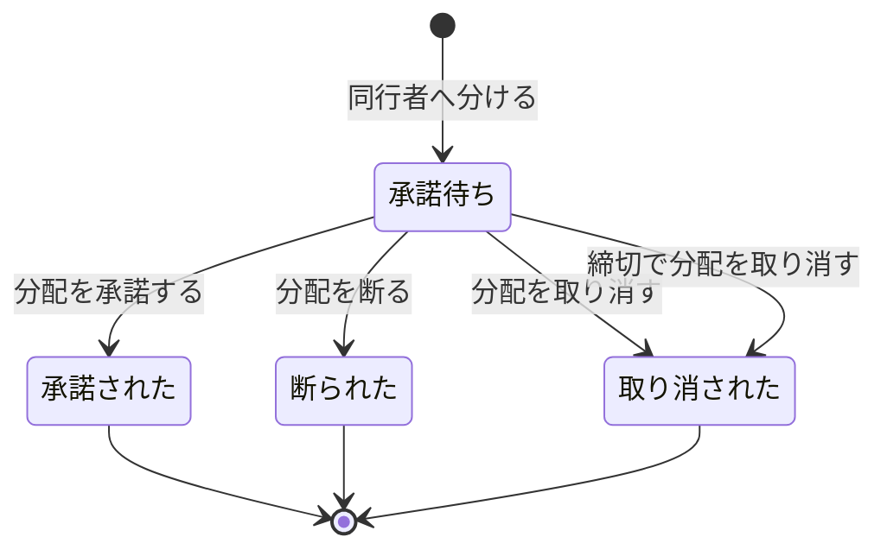

# チケットのドメインモデル

この文脈の集約は、チケットと分配の二つである。中心は分配で、一つの分配を一件の集約にし、承諾待ちから四つの終わりへの移り変わりと、締切と相手の指名に関わる拒む理由をすべてここに置いた。チケットは発券で生まれる権利の器で、席と購入者を変えずに持つだけであり、保有者は持たない。

## クラス図

```mermaid
classDiagram
    class Ticket["チケット"] {
        <<集約ルート>>
        +チケットを発券する(購入)
    }
    class TicketNumber["チケット番号"] {
        <<値オブジェクト>>
    }
    class Performance["公演"] {
        <<値オブジェクト・文脈共有>>
    }
    class SeatType["席の種類"] {
        <<値オブジェクト・文脈共有>>
    }
    class Seat["席"] {
        <<値オブジェクト・文脈共有>>
    }
    class QueueNumber["整理番号"] {
        <<値オブジェクト・文脈共有>>
    }
    class Purchaser["購入者"] {
        <<値オブジェクト>>
    }
    class Member["会員"] {
        <<値オブジェクト・文脈共有>>
    }
    class Purchase["購入"] {
        <<値オブジェクト・文脈共有>>
        購入が成立した
        購入者
        購入の枚数
        チケット
        保有者
        承諾待ち
    }
    class TicketIssued["チケットを発券した"] {
        <<ドメインイベント>>
    }

    class Distribution["分配"] {
        <<集約ルート>>
        +同行者へ分ける(チケット番号, 同行者, 購入, 出品, 払い戻し, 入場, 分配の締切)
        +分配を承諾する(分配の締切)
        +分配を断る()
        +分配を取り消す(分配の締切)
        +締切で分配を取り消す(分配の締切)
    }
    class Companion["同行者"] {
        <<値オブジェクト>>
        会員
        同じ公演のチケットの保有者
        同じ公演の承諾待ちの分配の相手
    }
    class Listing["出品"] {
        <<値オブジェクト・文脈共有>>
    }
    class Refund["払い戻し"] {
        <<値オブジェクト・文脈共有>>
    }
    class Admission["入場"] {
        <<値オブジェクト・文脈共有>>
    }
    class Deadline["分配の締切"] {
        <<値オブジェクト・文脈共有>>
    }
    class DistributedToCompanion["同行者へ分けた"] {
        <<ドメインイベント>>
    }
    class DistributionAccepted["分配を承諾した"] {
        <<ドメインイベント>>
    }
    class DistributionDeclined["分配を断った"] {
        <<ドメインイベント>>
    }
    class DistributionCancelled["分配を取り消した"] {
        <<ドメインイベント>>
    }
    class DistributionCancelledAtDeadline["締切で分配を取り消した"] {
        <<ドメインイベント>>
    }

    Ticket *-- TicketNumber
    Ticket *-- Purchaser
    Ticket *-- SeatType
    Ticket *-- Seat
    Ticket *-- QueueNumber
    Ticket --> Performance : 入場できる公演
    Purchaser --> Member : 購入をした会員
    Ticket ..> Purchase : 受け取る
    Ticket ..> TicketIssued : 発する

    Distribution *-- Purchaser
    Distribution *-- Companion
    Distribution --> TicketNumber : 分けるチケット
    Companion --> Member : 指名された会員
    Distribution ..> Purchase : 受け取る
    Distribution ..> Listing : 受け取る
    Distribution ..> Refund : 受け取る
    Distribution ..> Admission : 受け取る
    Distribution ..> Deadline : 受け取る
    Distribution ..> DistributedToCompanion : 発する
    Distribution ..> DistributionAccepted : 発する
    Distribution ..> DistributionDeclined : 発する
    Distribution ..> DistributionCancelled : 発する
    Distribution ..> DistributionCancelledAtDeadline : 発する
```

## チケット: 一枚の権利を一件にし、保有者は持たない

チケットの境界は一枚に引いた。この文脈でチケットが一件の中で守る決まりは、席（または整理番号）が発券の後に変わらないことだけで、それは一枚の中で閉じるからである。分配をチケットの内側に持てば「一枚に承諾待ちの分配は一つだけ」を一件の中で守れるが、その代わりに、保有者をチケットの内側で決め続けることになる。保有者はリセールで買った、というリセールの業務の事実でも変わり（業務知識「保有者は、最後に起きた権利の移り変わりで決まる」）、チケットの集約にはそれを受けるコマンドが無い。保有者を内側に持つと、チケットの外の事実で内側の値が古くなるので、チケットは保有者を持たず、分配も内側に持たない形にした。

### 守ること

チケットの席、席の種類、整理番号、購入者、公演を変えるコマンドはこの文脈に無く、発券で写した値がそのまま残る。一つの購入から一度だけ発券することは、複数のチケットにまたがる規則なので一枚のチケットの中では確かめられず、チケットを記録する側が守る。同じ購入の成立の知らせが同時に二度届いても、発券が一度だけ通ることもチケットを記録する側が保証する（BDD-035）。

### チケットを発券する

一回のコマンドで、受け取った購入の枚数だけのチケットが生まれ、チケットごとに購入に付いた席の種類と席（または整理番号）が一つずつ写り、チケット番号が付いて、それぞれが「チケットを発券した」を発する。この単位は仮置きである（未決）（BDD-001〜002）。

受け取った購入がまだ成立していなければ「成立していない購入に発券する」で拒む。これは受け取った購入の事実でコマンドが判断する（BDD-004）。すでに発券した購入への二度目の発券は「すでに発券した購入に発券する」で拒むが、その判断はコマンドの外、チケットを記録する側が行う（BDD-003）。

### 取り違えやすいもの

チケットは入場に使う画面の表示ではなく、保有者の記録でもない。保有者は、チケットを発券した、分配を承諾した、リセールで買った、のうち最後に起きたものが指す会員として導かれ、どの集約も値として持たない。購入者はチケットの内側の値で、分配やリセールがあっても変わらない。

## 分配: 一つの分配を一件にし、同じチケットの分配どうしの規則は外で守る

分配の境界は一つの分配に引いた。承諾、断り、取消、締切での取消のどれで終わるかは、一つの分配の中で一つに決まれば足りるからである。一枚のチケットの分配をまとめた集まりや、一つの購入の分配をまとめた集まりを集約にすれば、「一枚に承諾待ちは一つだけ」や「購入者の手元に一枚は残す」を内側で守れる。しかしそうすると、一つの分配を承諾するだけのコマンドが、同じ購入のほかの分配をすべて巻き込む。そこでこの二つの規則は、同行者へ分けるときに呼び手が購入の写し（チケットごとの保有者と承諾待ちの有無）を渡してコマンドが判断し、同時に来たときは集約の外で守る形にした。

### 状態遷移

断られたか取り消された後に同じチケットを分けるときは、終わった分配を戻すのではなく、新しい分配が承諾待ちで生まれる。

### 守ること

一つの分配は一つの終わりにしか移らない。同じ分配への承諾と取消、締切の直前の承諾と締切での取消が同時に来ても、分配の一件の中で先に受け付けた一つだけが通り、保有者が二人になる結果は生まれない。これは分配の集約自身が保証する（BDD-031、BDD-034）。

一枚のチケットに承諾待ちの分配は同時に一つだけであること、分けた後も購入者の手元に少なくとも一枚が残ることは、複数の分配にまたがる規則である。コマンドは受け取った購入の写しで判断するが、その写しは判断した瞬間のものにすぎないので、同じチケットを二人へ同時に分けたとき、手元の最後の二枚を同時に分けたときに規則を破らないことは、分配を記録する側が保証する（BDD-033、BDD-036）。

分配と出品が同じチケットで重ならないことは、分配の文脈とリセールの文脈にまたがる。同行者へ分けるは受け取った出品の事実で拒むが、同時に来たときにどちらか一つだけを通す守り手は、二つの文脈をまたいで一つに決める必要があり、仮置きで「チケットの移転を記録する側」とした（未決）（BDD-032）。

承諾待ちの分配があるチケットで購入者が入場できないことは、分配が承諾待ちであるという事実を入場の業務が読んで判断する。この文脈が保証するのは、承諾待ちの間は保有者が購入者のまま変わらないことである（BDD-005）。

### 同行者へ分ける

呼び手は、要求した会員が受け取る購入の購入者で、かつ分けるチケットの保有者であることをコマンドの前に確かめ、購入者でなければ「購入者でない会員が分ける」で、同行者として受け取ったチケットなら「受け取ったチケットを分ける」で拒む（BDD-010、BDD-015）。購入者だが、承諾やリセールですでに保有者でなくなったチケットを分けたときの拒む理由は業務知識に無く、提案に回した。

コマンドは、受け取った値で次を判断する。購入の枚数が1枚なら「一枚だけの購入のチケットを分ける」、分けた後に購入者が保有者で承諾待ちの無いチケットが残らないなら「購入者の手元に一枚も残らなくなる分配」、分けるチケットに承諾待ちの分配があれば「承諾待ちのチケットを分ける」、出品中なら「出品中のチケットを分ける」で拒む（BDD-008、BDD-009、BDD-011、BDD-012）。同行者が購入者本人なら「自分自身へ分ける」、同じ公演のチケットの保有者か同じ公演の承諾待ちの分配の相手なら「同じ公演のチケットを持つ会員へ分ける」で拒む（BDD-013、BDD-014）。払い戻しを決めた公演なら「払い戻しを決めた公演のチケットを分ける」、入場に使われたチケットなら「入場に使われたチケットを分ける」で拒む（BDD-016、BDD-017）。受け付けた時刻が分配の締切より後なら「分配の締切を過ぎた分配」で拒み、締切の時刻ちょうどは通す（BDD-006〜007）。

通ると、分配が承諾待ちで生まれ、購入者と指名された同行者を内側に持ち、「同行者へ分けた」を発する（BDD-005）。

### 分配を承諾する

指名された同行者であることは、呼び手が要求した会員と分配の同行者を照らしてコマンドの前に確かめ、違えば「指名されていない会員が承諾する」で拒む（BDD-019）。受け付けた時刻が分配の締切より後なら、ステージパスがまだ締切で取り消していなくても「分配の締切を過ぎた承諾」で拒む（BDD-021）。通ると「分配を承諾した」を発し、これによって保有者が同行者に変わる（BDD-018）。

承諾された、断られた、取り消されたの分配は、どれも「承諾待ちでない分配を承諾する」で拒む（BDD-020）。

### 分配を断る

指名された同行者であることは、承諾と同じく呼び手がコマンドの前に確かめ、違えば「指名されていない会員が分配を断る」で拒む（BDD-023）。締切を受け取らないのは、締切の後の承諾待ちの分配はすでに締切で取り消されていて、断る場面が無いからである。通ると「分配を断った」を発する（BDD-022）。

承諾された、断られた、取り消されたの分配は、どれも「承諾待ちでない分配を断る」で拒む。

### 分配を取り消す

その分配をした購入者であることは、呼び手が要求した会員と分配の購入者を照らしてコマンドの前に確かめ、同行者やほかの会員なら「購入者でない会員が分配を取り消す」で拒む（BDD-027）。受け付けた時刻が分配の締切より後なら「分配の締切を過ぎた取消」で拒む（BDD-026）。通ると「分配を取り消した」を発する（BDD-024）。

承諾された分配は「承諾された分配を取り消す」で拒む（BDD-025）。断られた、取り消されたの分配は「承諾待ちでない分配を取り消す」で拒む。

### 締切で分配を取り消す

ステージパスが分配の締切を過ぎたときに呼ぶコマンドで、会員の要求からは呼ばれない。受け付けた時刻が分配の締切の時刻ちょうどまでなら「分配の締切を過ぎていない分配を締切で取り消す」で拒む（BDD-030）。通ると「締切で分配を取り消した」を発し、チケットは購入者の手元へ戻るが、締切の後なので同じチケットを改めて同行者へ分けることは、同行者へ分けるの締切の拒む理由で通らない（BDD-028）。

承諾された、断られた、取り消されたの分配は、どれも「承諾待ちでない分配を締切で取り消す」で拒む（BDD-029）。

### 取り違えやすいもの

分配はリセールではない。無償で、指名した同行者へだけ移り、承諾されるまで保有者を動かさない。また、分配を承諾することは保有者を書き換えるコマンドではない。分配は「分配を承諾した」を発するだけで、保有者はその事実から導かれる。

## 業務知識への提案

### 受け付けた時刻

分配の締切の判断はすべて、ステージパスが行いを受け付けた時刻と分配の締切を比べて決まる（業務知識「導出されること」）。同行者へ分ける、分配を承諾する、分配を取り消す、締切で分配を取り消すの成否を変える値なのに、ユビキタス言語の表に無い。英名の候補は ReceivedAt で、業務用語としてユビキタス言語の表へ足すことを提案する（BDD-006〜007、BDD-021、BDD-026、BDD-030）。

### 購入者の手元に残る枚数

「購入者の手元に一枚も残らなくなる分配」の判断に使う値で、業務知識の「導出されること」に定義があるが、ユビキタス言語の表に無い。今回は、購入の写しの中の保有者と承諾待ちから導く形で描いた。英名の候補は RemainingTicketsInHand で、業務用語として表へ足すことを提案する（BDD-009、BDD-036）。

### 保有者でなくなったチケットを分ける

同行者へ分けるの成り立つ条件は「購入者で、いまも保有者である会員だけ」と書くが、購入者が、分配の承諾やリセールで保有者でなくなったチケットを分けようとしたときの拒む理由の名前とBDDが無い。「受け取ったチケットを分ける」は同行者の側の理由なので当たらない。業務の行いの同行者へ分けるに拒む理由として足し、BDDを一つ置くことを提案する。

### 分配番号

分配を承諾する、断る、取り消すは、どの分配かを指して呼ぶ。承諾待ちの分配はチケット番号で一つに決まるが、同じチケットには終わった分配が複数ありうる（BDD-020、BDD-024 の後に改めて分けた場合）。分配を見分ける語が業務知識に無いので、図には描いていない。英名の候補は DistributionNumber で、業務用語として足すかを決めてもらいたい。運営スタッフが分配の経緯を説明するときにも使える。

## 未決

**分配をチケットの内側に持たず、別の集約にしたこと（仮置き）。** 根拠は、保有者がリセールの業務の事実でも変わるのでチケットの内側で決め続けられないこと、一つの分配の承諾が同じ購入のほかの分配を巻き込まないことである。採らなかった案は、チケットを集約ルートにして分配をエンティティとして持つ案で、「一枚に承諾待ちは一つだけ」を一件の中で守れる。業務知識の未決「保有者をどの事実から決めるか」が、保有者をチケットの業務だけで決める答えに変われば、こちらの案を見直す。

**分配と出品が同時に来たときの守り手（仮置き）。** 分配を記録する側とリセールの側をまたぐ一つの守り手が要り、仮に「チケットの移転を記録する側」とした。業務知識の未決「移転は一つだけ、をどの業務の判断に置くか」と、リセールのドメインモデルが同じ答えにそろえば確定する。採らなかった案は、チケットに移転中を示す一つの判断を置き、ほかの文脈がそれを問い合わせる案である。

**発券の単位（仮置き）。** 一回のチケットを発券するで、一つの購入の枚数だけのチケットを生むとした。根拠は、業務知識が発券を購入ごとに一度だけの行いとして書いていることである。採らなかった案は、席ごとに一回ずつ呼ぶ案で、その場合は「一度だけ」の守り手が席ごとの重複も見ることになる。販売のドメインモデルで購入が成立したの受け取り方が決まれば確定する。

**断る、締切で取り消す、承諾の後の取戻しの有無。** 状態遷移図の断られたへの矢印、締切で分配を取り消すの矢印、承諾されたから戻る矢印が無いことは、業務知識の未決 Q3〜Q5 の仮置きにそのまま従った。主催者の答えで取戻しを認めれば、承諾されたから出る矢印と、それを持つコマンドが業務知識に足されてから図を直す。

**同行者の箱に、同じ公演での状況の写しを持たせたこと（仮置き）。** 同行者は分配の内側で指名された会員を表すが、同行者へ分けるの判断のために、同じ公演のチケットの保有者か、同じ公演の承諾待ちの分配の相手かの写しも持たせた。目的の違う二つを一つの箱に入れているので、業務知識の Q2（分ける相手の条件）が確定し、その写しを指す業務の語が決まったら、別の値に分ける。
