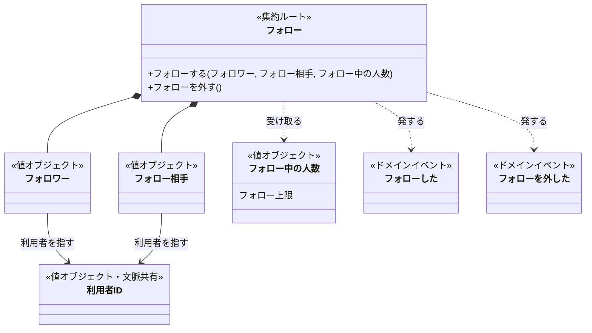
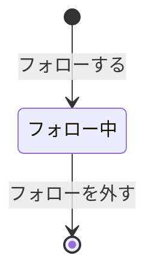

# フォローのドメインモデル

フォローの文脈の集約は、一人のフォロワーから一人のフォロー相手への一件のフォローだけである。フォロー上限はフォロワーのその時点のフォロー中の人数を値として受け取って判断し、同じ二人の間の重複はフォローを記録する側が守る。利用者と利用者IDはアカウントの業務のものなので、集約にせず値で指す。

## クラス図

## フォローの境界は、一人から一人への一件に引いた

一つのコマンドで一貫させたいのは、一件のフォローのフォロワーとフォロー相手が別の利用者であることと、そのフォローがフォロー中か終わったかだけである。どちらも一件のフォローの中で確かめられるので、境界はそこに引いた。フォロワーのフォロー全体を一つの集約にすればフォロー上限と重複を内側で守れるが、一人を外すだけのコマンドが最大5,000件のフォローを巻き込み、同じフォロワーの別の相手へのフォローとも互いに待たされることになるので採らなかった。

同じ二人の間でも、外した後にもう一度フォローすれば新しいフォローになる（BDD-009）。だから集約は「二人の間柄」ではなく、フォローした時に始まり外した時に終わる一件の出来事の持続として扱い、終わったフォローは再び使わない。

### 状態遷移

外すとフォローは終わり、「外した」という状態では残らない。この形は業務知識の仮置きに従っている（未決を参照）。

### 守ること

一件のフォローの中では、フォロワーとフォロー相手が同じ利用者にならず、どちらも生まれてから変わらない。

一件の中では確かめられない決まりが二つある。フォロー中の人数が5,000人を超えないことは、フォローするときに受け取るフォロー中の人数で判断するが、その値は判断した瞬間の写しにすぎない。同じ二人の間にフォロー中のフォローが一つしかないことは、生まれる前のフォローからは見えない。どちらも同時に起きると破れうるので、一人のフォロワーのフォローを記録する側が、同じフォロワーのフォローの成立を一つずつ受け付けて保証する（BDD-020、BDD-021）。一件のフォローが二度終わらないことも、同じ記録する側が保証する（BDD-022）。

フォローの変化と、それが発した「フォローした」「フォローを外した」は、片方だけが残ってはならない。成立した順に後から説明できるように、フォローを記録する側が両方を一緒に残す（BDD-009）。

### フォローする: 本人確認と相手の存在は呼び手が、自分自身と上限はこのコマンドが拒む

呼び手は、コマンドの前に、利用者登録を終えた本人が自分をフォロワーとして行っていることを確かめ、フォロー相手の利用者IDが登録済みの利用者を指すことを確かめる。「利用者登録を終えていない人がフォローする」「ほかの利用者としてフォローする」「存在しない利用者をフォローする」は、この段階で拒み、コマンドは呼ばれない（BDD-005、BDD-007、BDD-008）。

コマンドは、フォロワーとフォロー相手が同じ利用者なら「自分自身をフォローする」で拒む（BDD-004）。受け取ったフォロー中の人数がフォロー上限の5,000人に達していれば「フォロー上限に達している利用者がフォローする」で拒み、4,999人以下ならフォロー中のフォローを生んで「フォローした」を発する（BDD-001〜003）。外した相手をもう一度フォローしたときも、同じく新しいフォローが生まれる（BDD-009）。

「すでにフォロー中の相手をフォローする」は、生まれる前のフォローには判断できないので、フォローを記録する側が同じ二人のフォロー中のフォローを見つけたときに拒む（BDD-006、BDD-020）。この割り当ては仮に置いた（未決を参照）。

### フォローを外す: 外すフォローが無ければ、コマンドを呼ぶ前に拒む

呼び手は、利用者登録を終えた本人が、自分がフォロワーになっているフォロー中のフォローを外そうとしていることを確かめてから、そのフォローに対してコマンドを呼ぶ。「利用者登録を終えていない人がフォローを外す」「ほかの利用者としてフォローを外す」はこの段階で拒む（BDD-013）。呼び手が、指定された二人の間にその利用者がフォロワーのフォロー中のフォローを見つけられなければ、外す相手の集約が無いので「フォローしていない相手のフォローを外す」で拒む。フォロー相手の側から外そうとした場合も、自分自身や存在しない利用者を指した場合も、この理由になる（BDD-012、BDD-014）。

コマンドはフォローを終わらせて「フォローを外した」を発する。フォロー中の人数はフォローの数から導かれるので、外せば一人減り、上限に達していたフォロワーも次の一人をフォローできるようになる（BDD-010、BDD-011）。

### 取り違えやすいもの

「本人」「フォローしていない」は、フォローする相手を探す一覧で、見ている利用者から見た区別を表す語であり、フォローの状態ではない。フォローの状態はフォロー中だけで、外したフォローは「フォローしていない」状態のフォローとして残るのではなく、終わっている（BDD-018）。

フォロー中の人数は、フォローの中に持つ値ではない。そのフォロワーのフォロー中のフォローを数えて導く事実で、フォローするときに呼び手が数えて渡す。

## 業務知識への提案

### フォローを見分けるもの（語と英名の候補: フォローID / FollowId）

同じ二人の間で、外した後にもう一度フォローすると前とは別の新しいフォローになり、「フォローした」「フォローを外した」「フォローした」を成立順に説明できなければならない（BDD-009、常に守られることの「成立したフォローとフォロー解除は、成立した順に後から説明できる」）。フォロワーとフォロー相手の組では前後のフォローを見分けられないので、一件のフォローを見分ける語が要る。業務知識のユビキタス言語の業務用語へ足すことを提案する。今回は図に描いていない。

### フォローを記録する側の決まりとしての、重複の拒み方

「すでにフォロー中の相手をフォローする」を、生まれる前のフォローではなく、同じフォロワーのフォローを記録する側が拒むことを、業務知識の「同時に起きたとき」または「フォローする」の節に書き添えることを提案する。コマンドへ事実を渡す形を採るなら、「フォロワーがフォロー相手とのフォロー中のフォローを持っていないこと」を表す語（候補: 「フォロー中のフォローの有無」）が業務知識に要る。

## 未決

**重複の守り手（仮置き）。** 同じ二人の間のフォロー中のフォローが一つだけであることを、フォローを記録する側が守り、そこで拒む形に仮に置いた。根拠は、生まれる前の一件のフォローからは他のフォローが見えず、同時に二度フォローされたときも結局は記録する側が保証するしかないことである（BDD-020）。採らなかった案は、呼び手が「同じ相手とのフォロー中のフォローが無い」という事実を値にしてフォローするに渡し、コマンドが拒む案である。コマンドが拒む理由を返せる利点があるが、その事実を表す語が業務知識に無い。業務知識がその語を持つかどうかが決まれば確定する。

**フォロー上限の判断の置き場（仮置き）。** 呼び手が数えたフォロー中の人数をコマンドへ渡し、コマンドがフォロー上限と比べる形に置いた。業務知識の概念の節が「フォロー中の人数は一つのフォローの中には無く、フォローできるかはこの人数とフォロー上限で決まる」と書いていることが根拠である。採らなかった案は、フォロワーのフォロー全体を集約にする案（境界の節を参照）である。

**外したフォローを状態として残すか。** 業務知識の仮置きに従い、外すと終わる形にした。業務知識が「外した」状態を採れば、状態遷移図に終端の手前の状態が加わり、その状態で「フォローを外す」を拒む理由の節が要る。

**利用者IDの英名。** 業務知識で `未定` のため、クラス図の識別子 `UserId` は図のために仮に置いた。アカウントの業務知識で英名が決まれば差し替える。

**フォロー相手の語。** 業務知識の仮置きのまま使った。語が変われば図のラベルを差し替えるだけで、形は変わらない。
